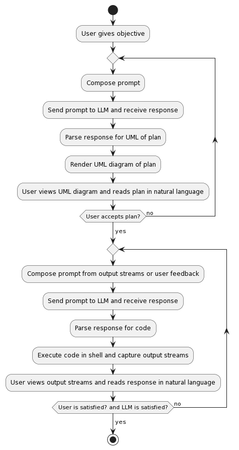

# Khod-Kaar: An LLM-powered code-writing and code-executing agent

[](https://github.com/danmohad/khod-kaar/actions/workflows/ci-main.yml)

Given a user's objective, `khod-kaar` will develop, test, document and execute code autonomously to achieve that objective.

`khod-kaar` will first guide the LLM to develop a plan for how to achieve the user's objective, and to output and render UML diagrams to show concretely the software development plan. This is called the 'discussion phase'.

Once the user consents to the plan, `khod-kaar` will guide the LLM to develop code relevant to the user's goal in a step-wise manner, including version control and testing. This is called the 'execution phase'. The user can step in and modify behavior by providing feedback to the LLM at any point in this phase.

Since `khod-kaar` has direct access to the shell, it provides the LLM with direct feedback from program execution and testing.

When the user's objective is met, the program gracefully exits.

The program flow is shown in the UML diagram below. Passing the `-a` flag activates full autonomy by presuming user agreement at both control points in the program flow, thereby only considering agent satisfaction as a control input. See [[Don't be reckless](#dont-be-reckless)] below.



## Requirements
- OpenAI API credentials
- [`plantuml`](http://sourceforge.net/projects/plantuml/files/plantuml.jar/download) to render the UML diagrams
- Python 3.9 or higher
- `pytest`, `openai`, `tiktoken`, `colorama` packages
- Docker, if using the recommended containerized build

### Setup
1. Clone the repo locally.
    - `git clone https://github.com/danmohad/khod-kaar`
2. Navigate to the cloned repo.
    - `cd /path/to/khod-kaar`
3. Add your OpenAI API credentials as environment variables. 
    - `OPENAI_API_KEY=<your api key>`
    - `OPENAI_ORG_KEY=<your organization, if you have one>`
4. Install dependencies
    - Follow the ['local installation procedure' for `plantuml`](https://plantuml.com/starting).
    - Run `pip install -r requirements.txt` in the repo's top-level directory.  A [python virtual environment](https://docs.python.org/3/library/venv.html) is most convenient for this.

### Containerized with Docker
Running the code in a containerized environment saves you the trouble of any dependency installations, and is safer for your file system. A Docker file is provided with the repo to set up a Debian environment with the necessary dependencies.

1. From the repo's top-level directory, build an image

        docker build -t khodkaar:cmdline -f .devcontainer/Dockerfile.cmdline --build-arg OPENAI_API_KEY=<your API key> --build-arg OPENAI_ORG_KEY=<your organization, if you have one>

2. Create and run a container from the image

        docker run -it --rm khodkaar:cmdline

### Ready-for-dev with VSCode
The easiest way to get started running and contributing to `khod-kaar` is by loading it as a dev container in VSCode. There are already some debugging cases set up in `.vscode/launch.json` to get you started.

1. Create a `.env` file in the repo's top-level directory with your OpenAI credentials.

2. Open the repo's top-level directory in VSCode as a Dev Container.

## Running
Suppose your objective is "to write, test and execute a simple Python program that writes 'Hello, World!'" Then to get `khod-kaar` to do this for you, it is as simple as:
```
python khod_kaar.py -m gpt-4 -t 0.0 -o "to write, test and execute a simple Python program that writes 'Hello, World!'.
```

Additional parameters are available and can be viewed by executing `python khod_kaar.py --help`.

At every step in the interaction, you have the options to input:
- `e`: Execute the code the LLM has output. If no code, send a canned message that you are in agreement with what the LLM is doing.
- `q`: Quit gracefully.
- _Anything else_: Don't execute any code, and instead give the text you provide as direct feedback to the LLM.

In this way, you are always in control of the program's behavior, both in terms of interaction with the LLM and code execution on your machine, unless you use the `-a` flag. See [[Don't be reckless](#dont-be-reckless)] below.

### Outputs
`khod-kaar` will write and run the code it generates in a new directory outside the repo. In addition, three files are generated in the untracked `output` directory inside the repo: `.plantuml` code, the associated `.png` rendered UML diagram, and `long_term_memory.json`.

To view the rendered UML diagram during execution, simply open the `.png` file. If you are running `khod-kaar` in Docker from the command line, then you must copy the image to the host first.

The file `long_term_memory.json` contains all interactions with the LLM in OpenAI API format.

## License
This repo is under an MIT License. Still, I urge you to be responsible with the abilities it gives you.

### Don't be evil
It's not difficult to think of ways to perform nefarious and antisocial actions with AI in general and LLMs in particular. Don't do them.

### Don't be reckless
Understand that `khod-kaar` interacts with the shell where it is run. Commands and code executed by `khod-kaar` may damage your machine or even other machines; it has just as much authority over the environment in which it is run as you do. Be sure you understand each shell command `khod-kaar` will execute before approving it. Exercise extreme caution in using the fully-autonomous `-a` flag, as it is meant primarily for debugging and demonstration purposes and __will execute arbitrary code on your machine without your consent and outside of your control__. 

## Similar projects and inspirations
There are so many LLM-agent type projects now, there's no way to list them all. Suffice it to say that I make no claim that the concepts here are not present in other projects. I was inspired by [AutoGPT](https://github.com/Significant-Gravitas/AutoGPT) to make an LLM-agent with plenty of autonomy, but I wanted the user to be able to exercise control at any time during execution, in case the LLM was getting stuck in a loop somewhere, which I found would often occur with `AutoGPT`. I wanted to build an LLM-based software engineer, and I liked the 'first discussion, then code' approach of [gpt-engineer](https://github.com/AntonOsika/gpt-engineer), but I wanted to do more than just code generation as text generation. I wanted to close the feedback loop for the LLM, so that it could actually execute and test the code that it was generating, and thereby use the results (and especially error messages) it generated to make modifications as needed. That's what `khod-kaar` does.

## Contributing
Pull requests are welcome! For some ideas on what to work on, see the [issues](https://github.com/danmohad/khod-kaar/issues). Please follow the [Google style guide for Python](https://google.github.io/styleguide/pyguide.html).

## What's with the name?
In many languages of south-central Asia and the Indian subcontinent, the word _khod_ means 'self' and _kaar_ means 'work' or 'action'. Thus, to many people, _khod kaar_ can render a meaning like 'autonomous action', which is what this repo does. _Khod_ also sounds like 'code', and _code kaar_ has a meaning approaching 'code worker' in those same languages, which is what this repo is. In Persian the term _khod kaar_ specifically means 'ball-point pen'. When compared to a quill or reed, a ball-point pen is certainly closer to autonomous action by easing the task of the writer, and that is also what this repo aims to do.
